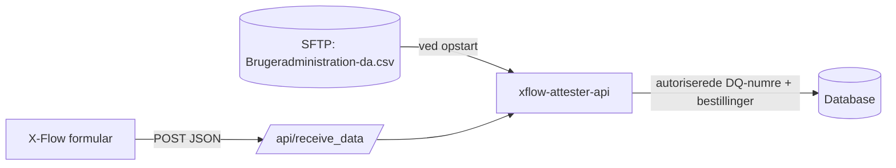

# xflow-attester-api
API der modtager attestbestillinger (straffeattest, børneattest m.fl.) fra X-Flow, validerer dem, kontrollerer at rekvirenten er leder/stedfortræder og gemmer bestillingen i databasen.

## Dataflow

1. **Ved opstart** hentes `/Brugeradministration-da.csv` (semikolon-separeret) fra SFTP. DQ-numre med rollen *Leder* eller *Stedfortræder for leder* gemmes i tabellen `authorized_sagsbehandlere` (listen erstattes hver gang). Kan SFTP ikke nås, starter app'en ikke.
2. **Ved modtagelse** valideres JSON, rekvirentens DQ-nummer slås op, og der oprettes **én række pr. bestilt attestType** i `attestation_requests`.
3. Bestillinger fra ikke-autoriserede rekvirenter gemmes også, men med `erGodkendt = false` og `erSendtTilManuelBehandling = true`.

> Data indeholder CPR-numre (personfølsomme oplysninger). Brug aldrig produktionsdata i test, og log ikke payloads.

## Endpoints
| Metode | Sti | Beskrivelse |
|---|---|---|
| POST | `/api/receive_data` | Modtager bestilling fra X-Flow |
| GET | `/healthz` | Health check – returnerer `{"status": "ok"}` |
| GET | `/metrics` | Prometheus metrics (bl.a. `http_server_errors_total`) |

### POST /api/receive_data
```json
{
    "sagsbehandler": "Fornavn Efternavn - DQ12345",
    "medarbejderCPR": "010190-1234",
    "attestType": "0, 1, 2",
    "attestSubType": [
        {"attestType": 0, "subType": 1},
        {"attestType": 2, "subType": 3}
    ],
    "samtykke": true
}
```
Valideringsregler:
* `sagsbehandler`: `Navn - DQ` + præcis 5 cifre.
* `medarbejderCPR`: `DDMMÅÅ-XXXX`.
* `attestType`: `0`, `1` og/eller `2` – int eller kommasepareret string, ingen dubletter.
* `attestSubType`: præcis ét objekt for hver bestilt attestType 0 og 2. AttestType 1 har ingen subtype (`[]` hvis kun 1 er bestilt).
* `samtykke`: boolean.

Svar:
* `200` – `{"status": "data received", "approvalStatus": "approved" | "denied", "requestId": "<uuid>"}`
* `400` – `{"errors": [...]}` ved valideringsfejl
* `503` – database ikke konfigureret

### Tabel `attestation_requests`
Primærnøgle: (`requestId`, `attestType`). Felter: `rekvirentDQ`, `rekvirentNavn`, `rekvisitusCPR`, `attestType`, `attestSubType`, `erGodkendt`, `erBestilt`, `erModtaget`, `erJournaliseret`, `erSendtTilManuelBehandling`, `erAdviseret`, `sbsysSagsNr`, `sbsysSagsID`, `anmodetTS`, `bestiltTS`, `modtagetTS`, `journaliseretTS`, `adviseretTS`.

Tabellerne oprettes automatisk ved opstart.

## Konfiguration
Miljøvariabler (secrets ligger i Bitwarden). Lokalt lægges de i en `.env` fil i projektets rod – den er git-ignored og må **aldrig** committes.

| Variabel | Beskrivelse |
|---|---|
| `DEBUG` | `True`/`False` |
| `PORT` | Port app'en lytter på (default `8080`) |
| `ATTEST_DB_TYPE` | `mssql`, `mariadb` eller `postgresql` (default `mssql`) |
| `ATTEST_DB_HOST` / `ATTEST_DB_PORT` | Database server |
| `ATTEST_DB_NAME` | Databasenavn |
| `ATTEST_DB_USERNAME` / `ATTEST_DB_PASSWORD` | Database login |
| `SFTP_HOST` / `SFTP_USERNAME` | SFTP server (SFTP-SDRoller) |
| `SFTP_PASSWORD` | SFTP kodeord – eller brug nøgle herunder |
| `SFTP_KEY_BASE64` / `SFTP_KEY_PASS` | Base64-kodet SSH nøgle og evt. kodeord (valgfri) |

## Udvikling
### Opsætning
* Windows: `setup-dev-windows.cmd` – Linux/Codespace: `. ./setup-dev-linux.sh`
* Scripts opretter `.venv` og installerer `src/requirements.txt` og `requirements-dev.txt`.

### Almindelige commands
* Start app'en: `python src/main.py`
* Start i docker: `docker compose up --build` (læser `.env`)
* Unit tests: `pytest`
* Lint: `flake8 --ignore=E501 src tests --show-source`

### Lokal database
`docker compose up --build` starter også en lokal Postgres (kun testdata):
* Forbind fra egen PC: `localhost:5433`, bruger `user` / `pass`, database `attester_db`
* Data bevares mellem genstarter. Ryd databasen med `docker compose down -v`

### Projektstruktur
* [src/main.py](src/main.py) – opretter Flask app, henter autorisationsliste fra SFTP, forbinder til DB
* [src/api_endpoints.py](src/api_endpoints.py) – `/api/receive_data`
* [src/attest_validation.py](src/attest_validation.py) – validering af payload
* [src/attest_database.py](src/attest_database.py) – tabeller, autorisationsliste og lagring af bestillinger
* [src/utils/](src/utils/) – config, logging/metrics, database-, SFTP- og API-klienter

### Kendte begrænsninger / TODO
* Gyldige subtype-koder er ikke fastlagt endnu (`VALID_SUBTYPES_BY_TYPE` i [attest_validation.py](src/attest_validation.py)).
* Autorisationslisten opdateres kun ved opstart.
* Bekræftelse/afvisning sendes endnu ikke til rekvirenten – kun som HTTP-svar.
* SFTP-serverens host key verificeres ikke.


### Logning
* Logning gøres med logger og **ikke** print() functionen
```
import logging
logger = logging.getLogger(__name__)
logger.info('My log line')
```
* Logning til stdout med filtrering (kald til /healthz og /metrics fjernes) er sat op i [logging.py](src/utils/logging.py) og kaldes fra [main.py](src/main.py)

### Scheduler - kør kode på bestemt tidspunkt eller med interval
* Lav endpoint der starter jobbet og Kald endpoint med cronjob i kubenetes
